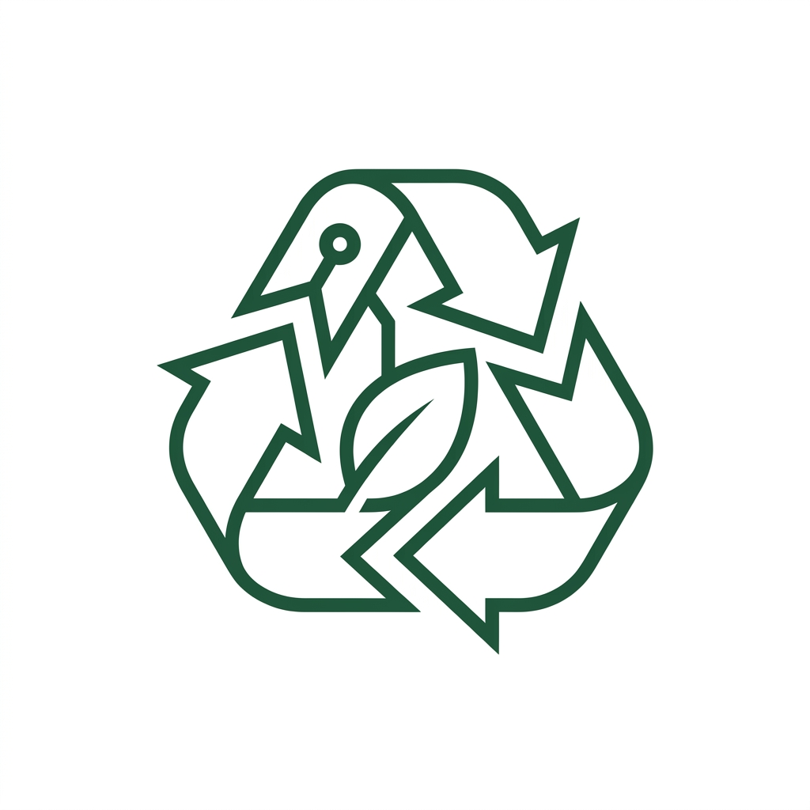

<p align="center">
  
</p>

<h1 align="center">Recycla</h1>

<p align="center">
  <strong>AI-powered smart bin that classifies and sorts campus waste automatically.</strong><br/>
  Built for CMPE 246 — University of British Columbia
</p>

<p align="center">
  <em>Stop guessing. Start recycling right.</em>
</p>

---

## What is Recycla?

Recycla is an embedded system that uses computer vision and machine learning to sort waste into recycling or garbage — automatically. An ultrasonic sensor detects when someone approaches the bin, a camera captures the item, a MobileNetV2 neural network classifies the material, and servo motors open the correct compartment. No labels, no signs, no guessing.

**Classification happens in under 200ms on a Raspberry Pi 4.**

## How It Works

```
Ultrasonic Sensor → Object detected within 30cm
        ↓
Arducam 8MP Camera → Captures image
        ↓
MobileNetV2 (TFLite INT8) → Classifies material
        ↓
Confidence ≥ 70%? → Yes: open correct bin (recycling/garbage)
                  → No:  default to garbage (prevents contamination)
```

## Repository Structure

```
Recycla/
├── model/                  # ML training pipeline
│   └── AI_Model.ipynb      # Colab notebook — train, evaluate, export TFLite
│
├── hardware/               # Raspberry Pi deployment
│   └── smart_bin.py        # Main controller — sensors, camera, servos, inference
│
├── website/                # Promotional website (Vite + vanilla JS)
│   ├── src/                # Source code (JS, CSS, assets)
│   ├── public/             # Static assets
│   ├── index.html          # Home page
│   ├── technology.html     # Tech stack breakdown
│   ├── vision.html         # Future roadmap & concept renders
│   ├── team.html           # Team profiles
│   ├── vite.config.js
│   └── package.json
│
└── docs/                   # Project assets
    └── recycla_logo.png
```

## Tech Stack

| Component | Details |
|-----------|---------|
| **Compute** | Raspberry Pi 4 (4GB RAM, ARM Cortex-A72) |
| **Camera** | Arducam 8MP V2.3 (Sony IMX219) |
| **Sensor** | HC-SR04 Ultrasonic |
| **Actuators** | 4x SG90 Servo Motors (2 per bin) |
| **ML Model** | MobileNetV2 — transfer learning from ImageNet |
| **Inference** | TensorFlow Lite INT8 quantized (~5-10MB) |
| **Training** | Google Colab (GPU) |
| **Categories** | Glass, Metal, Paper, Plastic, Other |
| **Website** | Vite 8 + Vanilla JS |

## Getting Started

### Train the Model (Google Colab)

1. Open `model/AI_Model.ipynb` in Google Colab
2. Add your training images to Google Drive under `CMPE246/Dataset/<class_name>/`
3. Run Cells 1 through 7 sequentially
4. Cell 7 exports `waste_classifier_V6.tflite` and `class_indices_V6.json`

### Deploy to Raspberry Pi

1. Copy `waste_classifier_V6.tflite`, `class_indices_V6.json`, and `hardware/smart_bin.py` to `~/smart_bin/` on the Pi
2. Install dependencies:
   ```bash
   sudo apt update && sudo apt install -y python3-tflite-runtime python3-picamera2 python3-gpiozero pigpio
   sudo systemctl enable pigpiod && sudo systemctl start pigpiod
   ```
3. Run:
   ```bash
   python3 ~/smart_bin/smart_bin.py
   ```

### GPIO Wiring

| Component | GPIO Pin | Physical Pin |
|-----------|----------|-------------|
| Ultrasonic TRIG | GPIO 23 | Pin 16 |
| Ultrasonic ECHO | GPIO 24 | Pin 18 |
| Recycle Servo L | GPIO 17 | Pin 11 |
| Recycle Servo R | GPIO 22 | Pin 15 |
| Garbage Servo L | GPIO 27 | Pin 13 |
| Garbage Servo R | GPIO 25 | Pin 22 |
| Ultrasonic VCC | 5V | Pin 2/4 |
| All Servo VCC | **External 5V PSU** | — |
| All GND | Shared GND | Pin 6/9/14 |

> **Important:** Power the 4 servos from an external 5V 3A+ supply, not the Pi's 5V pin. Connect the external PSU ground to a Pi GND pin for common ground.

### Run the Website Locally

```bash
cd website
npm install
npm run dev
```

## Adding New Training Data

1. Drop new images into `Google Drive → CMPE246/Dataset/<class_name>/`
2. Run Cell 6 in the notebook to re-sync
3. Re-run Cells 2 → 3 → 4 → 5 → 7
4. Copy the new `.tflite` file to the Pi

To add a new waste category (e.g., `cardboard`), create a new folder under `Dataset/` with at least 100 images, retrain, and add the class to `BIN_MAP` in `smart_bin.py`.

## Team

| Name | Role |
|------|------|
| **Adam Hassan** | Team Lead & Marketing |
| **Zivan Erdevicki** | Software Design & Development |
| **Bassam Alghamdi** | Machine Learning & Integration |
| **Mahmoud Rabie** | Hardware & Integration |

## License

This project was built as part of CMPE 246 at the University of British Columbia (Okanagan).
